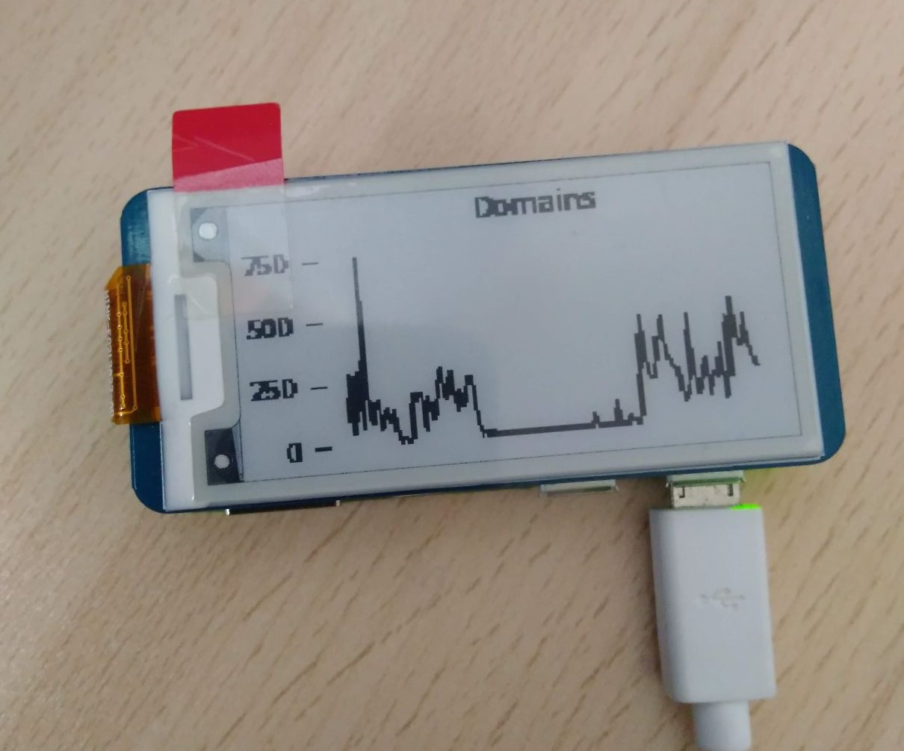
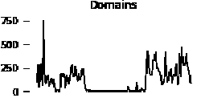

# PiHole-EInk-Graph
PiHole graph on a Waveshare 2.13" E-Ink display

## Images
### Finished build

### .bmp displayed image

## Technologies
* Python 3.8.7
* matplotlib 3.0.2
* PiHole 5.2.23
* PiHole-api 2.6

## Dependencies
* Raspberry Pi 
* [Waveshare 2.13" E-Ink display V2](https://www.waveshare.com/2.13inch-e-paper-hat.htm)
    * For displays with other dimension you need to change sizes on lines 25 and 36
* [Waveshare e-Paper libraries](https://github.com/waveshare/e-Paper)
    * These libraries are already included in this repository
* [matplotlib](https://matplotlib.org/) 
* [PiHole](https://pi-hole.net/) 
* [PiHole-api](https://pypi.org/project/PiHole-api/)

## Setup
1. Install RaspberryPi OS (preferably the Lite version without desktop) on a RaspberryPi connected to the E-Ink display
2. Install [PiHole](https://pi-hole.net/) using command `$ curl -sSL https://install.pi-hole.net | bash`
    * for additional options, check PiHole [documentation](https://github.com/pi-hole/pi-hole/#one-step-automated-install)
3. install the E-Ink display according to the instruction on [Waveshare wiki](https://www.waveshare.com/wiki/2.13inch_e-Paper_HAT)
4. Write down the **IP address** and **password** for the admin interface
5. Install matplotlib with `$ sudo apt-get install python3-matplotlib`
6. Install PiHole-api with `$ pip3 install PiHole-api`
7. Run *PiHole_EInk_Graph.py* with `$ nohup python3 PiHole_EInk_Graph.py &`
    * **Optional:** You can add an IP that is different from the PiHole running locally by adding a parameter `-a` and an ip (for example: `$ nohup python3 PiHole_EInk_Graph.py -a 192.168.255.255 &`)
    * note: PiHole must have some graph data already for it to display
    * Raspberry Pi might reboot at first start, after the reboot just start the program again
8. Passing a KeyboardInterrupt will clear the display and then exit